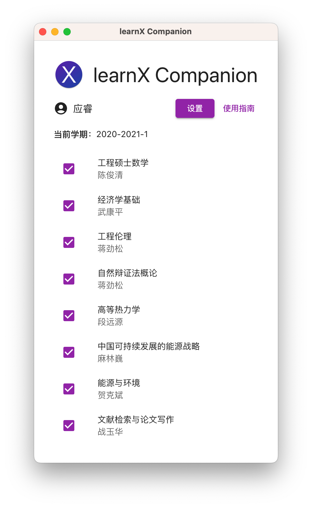
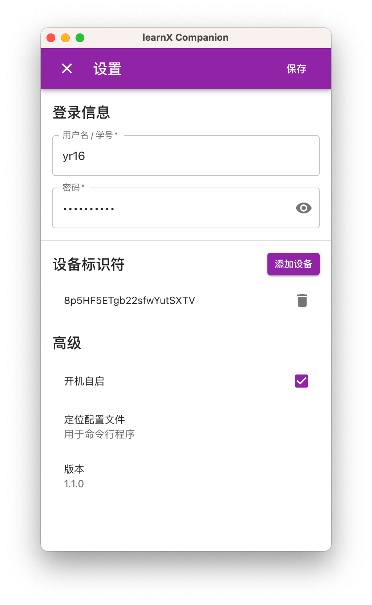

<div align="center">


<h1>learnX Companion</h1>

清华大学网络学堂 App 助手，为 <a href="https://tsinghua.app/learnX" target="_blank" rel="noopener noreferrer">learnX</a> 提供个性化的推送通知支持。

> 需要 v14.0.0 及以上版本的 learnX 应用。
>
> 暂仅支持 iOS/iPadOS 与 macOS 的推送通知，不支持 Android。

<a href="https://github.com/robertying/learnX-companion/releases" target="_blank" rel="noopener noreferrer"></a>



</div>

## 下载

[GitHub Releases](https://github.com/robertying/learnX-companion/releases)

> 注意：
>
> GUI 桌面应用仅支持 ARM macOS、Intel macOS 以及 64 位 Windows。
>
> Linux 及其它服务器环境可使用 Docker Image，详见[高级](#高级)。

## 反馈

此应用未经大规模测试，如有问题，请提交 [GitHub Issues](https://github.com/robertying/learnX-companion/issues)。

## 使用

> 注意：
>
> 此功能需要配合 v14.0.0 及以上版本的 learnX 应用使用。
>
> 暂仅支持 iOS/iPadOS 与 macOS 的推送通知，不支持 Android。

1. 打开 learnX Companion 应用（Windows 下运行安装程序后应用会自动启动）。应用启动后，会自动最小化至菜单栏（macOS）或托盘（Windows）。在菜单栏（macOS）或托盘（Windows）找到 “X” 图标并点击，选择“打开 learnX Companion” 进入主界面。
2. 点击“登录”按钮，进入设置界面。

   

3. 输入用户名/学号以及密码。

4. 在需要接收推送通知的设备上打开 learnX 应用，进入“设置”-“推送通知”页面。确保 learnX 具有推送通知权限后，可在此页面看到推送所需的设备标识符，点击“复制设备标识符”可将字符串复制到剪贴板。点击 learnX Companion 设置界面的“添加设备”按钮，将复制的设备标识符加入推送列表。

5. 如果需要在多个设备上同时接收推送通知，对每个设备重复以上步骤。

6. 填写完用户名/学号和密码，添加完设备的标识符后，点击“保存”按钮保存设置。

7. 在主界面中，来自已勾选课程的内容更新将被推送，未勾选课程的更新不会被推送。

8. 完成设置后，可关闭窗口。此时 learnX Companion 将在后台运行：定期获取网络学堂数据，并将内容更新推送到已添加的设备。

> 注意：
>
> learnX Companion 将用户名/学号与密码明文保存在本地文件中。
>
> 如选择使用此应用，请自行维护本地数据的安全。

## 高级

GUI 应用会在后台运行以获取最新的网络学堂数据。这意味着当运行 learnX Companion 的设备关机时，推送通知会停止。

如果你希望 24 小时都能使用推送通知，推荐通过 Docker 在服务器（或任何不常进入休眠/关机状态的设备）上运行 learnX Companion。

1. 根据[使用](#使用)中提到的步骤完成 GUI 应用的设置后，在“设置”界面的“高级”部分中，点击“定位配置文件”。

2. 将配置文件复制到运行 Docker 的设备上，运行：

   ```bash
   docker run -d --name learnx --restart unless-stopped -v /some/path/config.json:/app/config.json robertying/learnx-companion:latest
   ```

   请将 `/some/path/config.json` 替换为配置文件在宿主机上的路径，如：

   ```bash
   docker run -d --name learnx --restart unless-stopped -v /home/yr16/config.json:/app/config.json robertying/learnx-companion:latest
   ```

3. 可通过 `docker logs learnx` 查看运行日志。

4. 配置文件为 JSON 格式，可以自行理解并编辑，更改配置本质上不需 GUI 应用。
